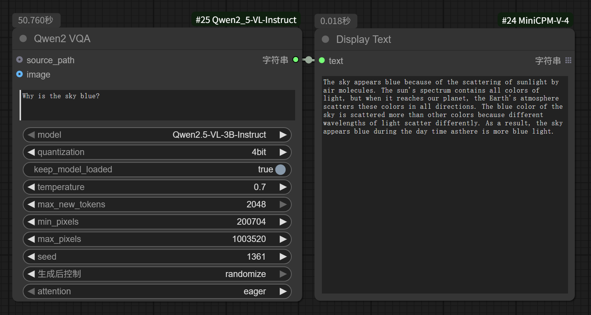
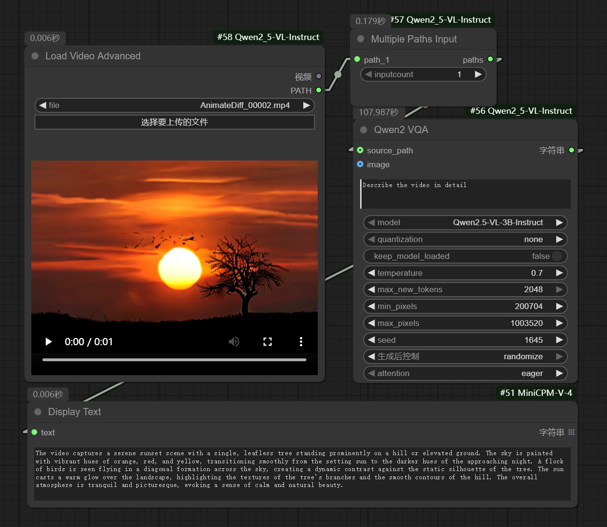
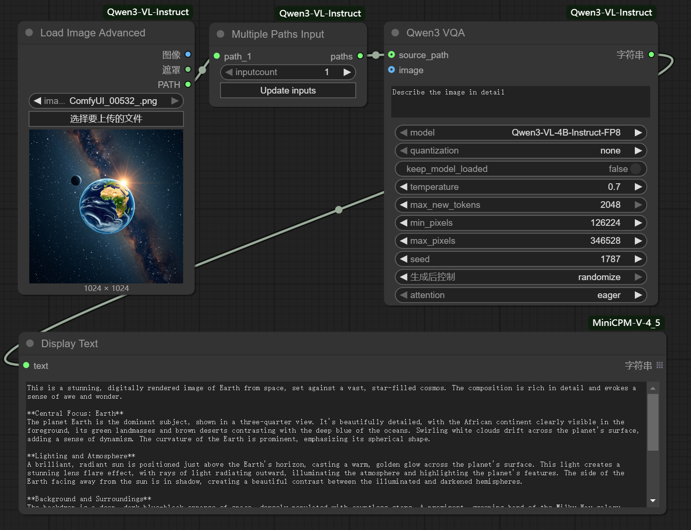
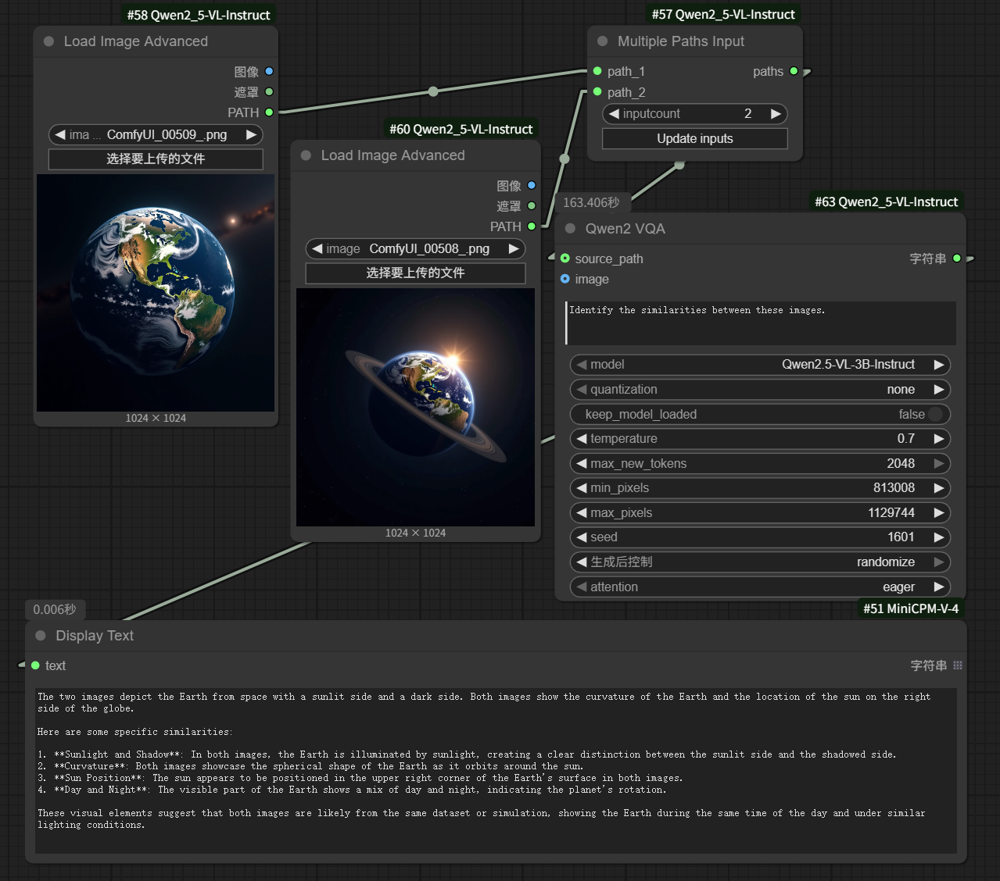

# ComfyUI_Qwen2-VL-Instruct with Apple Silicon support

### Major changes:

- Added Image as input so you can use a **Load Image** or **Load Image List From Dir** node directly.
- Replaced the unsupported decord (latest python version supported by eva-decord is 3.11<sup>§</sup>) with python-opencv.
- Removed non-applicable `auto-gptq` module so setup would work without error.
- Obtain and set GPU device from ComfyUI instead of hardcoded to mps. It will be set correctly to 'mps' if your ComfyUI is running on Apple Silicon Macs.
- Added a System prompt to Qwen. It will be handy if you are running an _abliterated_ model ;-)
- Allow one to specify the Flash Attention model from the node. ** Note** Only "eager" will work on the Apple Silicon for now<sup>§</sup>.

§ Notes on torch and python versions:

* [Eva-decord](https://pypi.org/project/eva-decord/) is a fork of [decord](https://pypi.org/project/decord/) that supports ffmpeg5 and builds/installs on newer macos versions. However, eva-decord is no longer available for Python version above 3.11.

* Somehow, (incompatibility with later PyTorch?) the following error occurs when doing inference on PyTorch version above 2.4:

   `IndexError: Dimension out of range (expected to be in range of [-3, 2], but got 3)`

    Setting the attention mode to "eager" solved the problem. If you are using torch 2.4 or below,the original "sdpa" would work just fine.

## Installation

If you have already have the original repository installed, remove it first.

Either install from the ComfyUI Manager using *Install via Git URL* and enter the URL of this repository, or,

Download or git clone this repository into the `ComfyUI/custom_nodes/` directory, then install the python packages in your ComfyUI Python environment:

```bash
cd ComfyUI/custom_nodes/
git clone git@github.com:edwios/ComfyUI_Qwen2-VL-Instruct.git
cd ComfyUI_Qwen2-VL-Instruct
pip install -r requirements.txt
```
**Restart ComfyUI** when installation is done and successful.

# Original README

# ComfyUI_Qwen2-VL-Instruct

This is an implementation of [Qwen2-VL-Instruct](https://github.com/QwenLM/Qwen2-VL) by [ComfyUI](https://github.com/comfyanonymous/ComfyUI), which includes, but is not limited to, support for text-based queries, video queries, single-image queries, and multi-image queries to generate captions or responses.

---

## Basic Workflow

- **Text-based Query**: Users can submit textual queries to request information or generate descriptions. For instance, a user might input a description like "What is the meaning of life?"



- **Video Query**: When a user uploads a video, the system can analyze the content and generate a detailed caption for each frame or a summary of the entire video. For example, "Generate a caption for the given video."



- **Single-Image Query**: This workflow supports generating a caption for an individual image. A user could upload a photo and ask, "What does this image show?" resulting in a caption such as "A majestic lion pride relaxing on the savannah."



- **Multi-Image Query**: For multiple images, the system can provide a collective description or a narrative that ties the images together. For example, "Create a story from the following series of images: one of a couple at a beach, another at a wedding ceremony, and the last one at a baby's christening."



## Installation

- Install from [ComfyUI Manager](https://github.com/ltdrdata/ComfyUI-Manager) (search for `Qwen2`)

- Download or git clone this repository into the `ComfyUI\custom_nodes\` directory and run:

```python
pip install -r requirements.txt
```

## Download Models

All the models will be downloaded automatically when running the workflow if they are not found in the `ComfyUI\models\prompt_generator\` directory.
